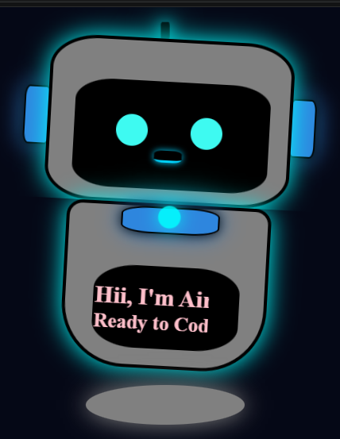

# 🤖 Airi — AI Robot Mascot

A cute AI-inspired robot mascot built using **HTML & CSS**.  
Airi is designed with glowing effects, animations, and a futuristic interface to bring a simple robot character to life.

## 📸 Preview

[🎥 Watch Airi Robot Demo](Airi.gif)

##  Meet Airi 


## ✨ Features

- 🤖 Custom AI robot mascot design
- 💡 Glowing antenna and ears
- 👀 Animated blinking eyes
- ⌨️ Typing animation introduction
- 🌌 Futuristic AI-themed background
- ✨ Smooth CSS animations

## 🛠️ Technologies Used

- HTML5
- CSS3
- CSS Animations

## 📂 How to Run Locally

1. Clone the repository

```bash
git clone  https://amritasoni-dev.github.io/AI-Mascot/robo.html
```

2. Open the project folder

3. Open `index.html` in your browser

## 🎯 Purpose

This project was created to practice:
- CSS animations
- Creative UI design
- Character-based web design
- Bringing ideas to life with code

## 👨‍💻 Author

Amrita Soni 
Upcoming CS-AI Student 🚀
